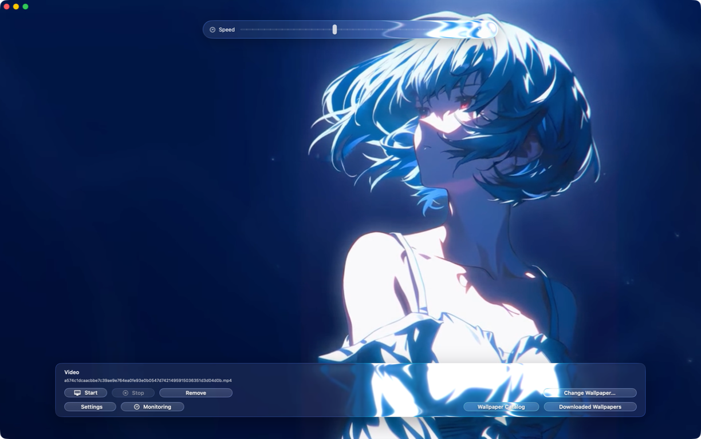

[](https://github.com/mkanami/AuraFlow/releases)

# AuraFlow

AuraFlow is a native macOS live wallpaper app. It uses a Swift control app, a separate AppKit + AVFoundation wallpaper agent, and a small Objective-C bridge for the Liquid Glass layer.

<p align="center">
  
</p>

## Current Runtime

AuraFlow uses a native split runtime built from these macOS targets:

- `WallpaperControlApp`: SwiftUI control app for preview, catalog, downloads, settings, and playback controls.
- `AuraWallpaperAgent`: helper executable that owns desktop wallpaper windows and AVFoundation playback.
- `AuraWallpaperCore`: shared Swift models, JSON runtime state, command files, metrics, and wallpaper backup/restore logic.
- `AuraGlassBridgeKit`: small Objective-C/AppKit bridge used only for the glass visual layer.

Runtime state is stored in:

```text
~/Library/Application Support/AuraFlow
```

## Features

- local video/GIF/image wallpaper preview and playback
- one wallpaper window per display
- start, stop, and remove wallpaper actions
- restore the latest non-AuraFlow wallpaper when live wallpaper is removed
- playback speed control
- fill, fit, and stretch scale modes
- auto-pause while fullscreen apps are active
- matching live system screen saver with a direct Start button
- launch at login through a LaunchAgent
- built-in wallpaper catalog
- downloaded wallpaper library
- optional video compatibility optimization

## UI

- native Liquid Glass path on macOS 26 and newer
- blur-based fallback UI on older supported macOS versions
- native window controls
- optimized window drag and resize handling
- preview playback handled independently from wallpaper playback

## System Requirements

- macOS 13 or later
- Apple Silicon or Intel Mac
- internet connection for catalog downloads

## Lock Screen

**Play AuraFlow on Lock Screen** is opt-in and disabled by default. When you
turn it on in Playback Settings, AuraFlow uses the selected wallpaper through
macOS's Aerial provider for both the Desktop and the real Lock Screen. The
original Aerial asset, wallpaper configuration, and system Lock Screen URL are
backed up before the first change and restored when this feature is disabled.
The Lock Screen-only action updates only macOS's Idle/Lock Screen selection and
keeps the current Desktop wallpaper unchanged.

The current wallpaper, thumbnail, active Spaces, and displays are synchronized each
time the wallpaper starts. Deleted Space records and old AuraFlow
`last_frame.png` references are removed during the transaction. On macOS
versions without the modern Aerial store, AuraFlow falls back to its bundled
legacy Screen Saver module.

The native Aerial route is an optional capability, not a requirement for starting
AuraFlow. It is enabled only when the OS is macOS 26 or newer, the bundled
`AuraWallpaperNativeBridge` is executable, its code signature is valid, and its
startup capability handshake confirms the expected protocol, architecture,
private frameworks, and symbols. The control app and the portable wallpaper
agent never link Apple's private `Wallpaper` frameworks. If any preflight or
runtime check fails, AuraFlow disables the native route and uses the legacy
Screen Saver path without claiming that the native installation succeeded.

`Wallpaper.framework` and `WallpaperTypes.framework` are private Apple frameworks.
The native bridge is therefore distributed as a separate optional executable and
is supported only in the direct-download distribution. A future macOS update can
disable this route until compatibility is added; a successful notarization does
not guarantee private API compatibility.

**Remove** stops the live wallpaper agent, restores the reserved Aerial asset
and backed-up wallpaper configuration, clears the selected video, restores the
original desktop on every current Space, and restarts the macOS wallpaper
presenters so no managed stop frame is left behind. The current Lock Screen
preference is retained by the runtime configuration.

For release builds, `ffmpeg` and `ffprobe` are bundled when available on the build machine. They are used only for compatibility conversion paths, not for normal AVFoundation playback.

## Install

Download `AuraFlow.dmg` from GitHub Releases, open it, and drag `AuraFlow.app` into `/Applications`.

GitHub Releases are the supported distribution channel. Release artifacts must
be Developer ID signed and notarized; the project is not distributed through the
Mac App Store because the optional native bridge links private Apple frameworks.
Local ad-hoc builds are useful for development only and may show a Gatekeeper
warning.

## Build

Build the app and release artifacts:

```bash
./build_app.sh
```

Universal build:

```bash
BUILD_UNIVERSAL=1 ./build_app.sh
```

The build output is written to:

```text
dist/AuraFlow.app
dist/AuraFlow.zip
dist/AuraFlow.dmg
```

## Test

```bash
cd macOSApp
DEVELOPER_DIR=/Applications/Xcode.app/Contents/Developer swift test
```

## Release Packaging

`scripts/build_release.sh` builds the Swift targets, stages the app bundle, signs nested Mach-O binaries, signs the app bundle, and packages ZIP and DMG artifacts.

The control app, wallpaper agent, and bundled legacy Screen Saver are built with
macOS 13.0 as their deployment target. The native `AuraWallpaperNativeBridge` is
optional: it is built and included only when a macOS 26 SDK and both private
Wallpaper frameworks are available. On older SDKs the release continues without
the bridge and uses the legacy Lock Screen fallback at runtime. Set
`REQUIRE_NATIVE_BRIDGE=1` when a build must fail instead of producing a fallback-only
artifact.

When `CODESIGN_IDENTITY` is set to a Developer ID Application certificate, the
release workflow signs and notarizes the app and DMG. The packaging script also
fails if private framework linkage leaks into the control app, wallpaper agent, or
screen saver; only an included `AuraWallpaperNativeBridge` may contain those links.
The GitHub release workflow refuses to publish an ad-hoc artifact.

## Project Layout

- `macOSApp/Package.swift`: SwiftPM package definition
- `macOSApp/Sources/WallpaperControlApp`: SwiftUI control app
- `macOSApp/Sources/AuraWallpaperAgent`: native wallpaper helper process
- `macOSApp/Sources/AuraWallpaperCore`: shared runtime models and storage
- `macOSApp/Sources/AuraGlassBridgeKit`: Objective-C glass bridge
- `macOSApp/Tests`: Swift tests
- `scripts/build_release.sh`: build, signing, and packaging script
- `Resources`: app icon assets
- `docs`: README images

## License

MIT
